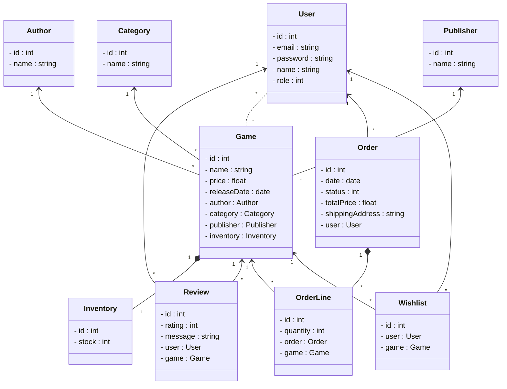

```mermaid
classDiagram
    direction TB
    class Author {
        - id : int
        - name : string
    }

    class Category {
        - id : int
        - name : string
    }

    class Publisher {
        - id : int
        - name : string
    }

    class Inventory {
        - id : int
        - stock : int
    }

    class Order {
        - id : int
        - date : date
        - status : int
        - totalPrice : float
        - shippingAddress : string
        - user : User
    }

    class OrderLine {
        - id : int
        - quantity : int
        - order : Order
        - game : Game
    }

    class Review {
        - id : int
        - rating : int
        - message : string
        - user : User
        - game : Game
    }

    class Wishlist {
        - id : int
        - user : User
        - game : Game
    }

    class User {
        - id : int
        - email : string
        - password : string
        - name : string
        - role : int
    }

    class Game {
        - id : int
        - name : string
        - price : float
        - releaseDate : date
        - author : Author
        - category : Category
        - publisher : Publisher
        - inventory : Inventory
    }

    Author "1" <-- "*" Game
    Category "1" <-- "*" Game
    Publisher "1" <-- "*" Game
    Game "1" *-- "1" Inventory
    User "1" <-- "*" Review
    Game "1" <-- "*" Review
    User "*" .. "*" Game
    User "1" <-- "*" Order
    Order "1" *-- "*" OrderLine
    Game "1" <-- "*" OrderLine
    User "1" <-- "*" Wishlist
    Game "1" <-- "*" Wishlist
```