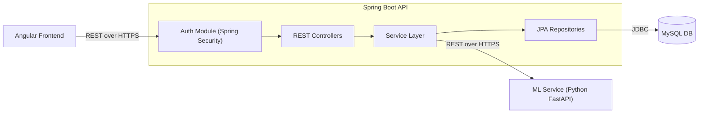

```mermaid
graph LR
    UI["Angular Frontend"]

    subgraph SpringAPI["Spring Boot API"]
        direction TB
        Auth["Auth Module (Spring Security)"]
        Controllers["REST Controllers"]
        Services["Service Layer"]
        Repos["JPA Repositories"]
    end

    ML["ML Service (Python FastAPI)"]
    DB[(MySQL DB)]

    UI -->|REST over HTTPS| Auth
    Auth --> Controllers
    Controllers --> Services
    Services --> Repos
    Repos -->|JDBC| DB

    Services -->|REST over HTTPS| ML
```