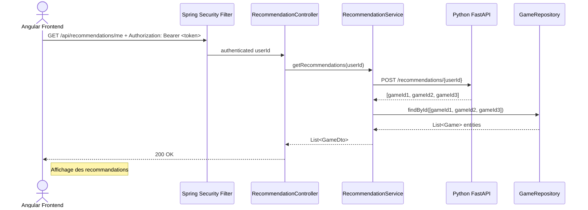

```mermaid
sequenceDiagram
    actor UI as Angular Frontend
    participant Auth as Spring Security Filter
    participant Controller as RecommendationController
    participant Service as RecommendationService
    participant ML as Python FastAPI
    participant RepoGame as GameRepository

    UI->>Auth: GET /api/recommendations/me + Authorization: Bearer <token>
    Auth->>Controller: authenticated userId
    Controller->>Service: getRecommendations(userId)
    Service->>ML: POST /recommendations/{userId}
    ML-->>Service: [gameId1, gameId2, gameId3]
    Service->>RepoGame: findById([gameId1, gameId2, gameId3])
    RepoGame-->>Service: List<Game> entities
    Service-->>Controller: List<GameDto>
    Controller-->>UI: 200 OK
    note right of UI: Affichage des recommandations

```